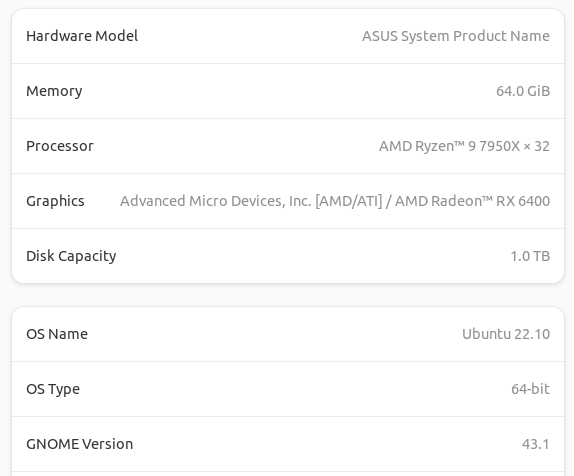

# Thinking In SIMD

## Intro

The ubiquity and effectiveness of AVX intrinsics in the most popular programming languages has opened up a whole new paradigm for software optimization. Behind the scenes, compilers have embraced the AVX instruction sets, and will automatically apply them when appropriate ("autovectorization"). But autovectorization is generally only applied on shallow/obvious use cases. Don't just take it from me, here's Linus Torvalds:

>It's easy to wave your hands and say "just use vector units". You see people doing it here. In reality, not only has auto-vectorization not ever done so great in the first place, there aren't many places to do it at all. [1]

But if you venture into the world of manually applying intrinsic functions, they can give you power far beyond what compilers can accomplish today.

## What are SIMD intrinisics?

I'm not going to answer this. But [here's a good C++ reference](http://const.me/articles/simd/simd.pdf) and [here for C#](https://devblogs.microsoft.com/dotnet/hardware-intrinsics-in-net-core/).

## What's the problem?

The biggest problem is that software architecture and API design are mostly not organized in a ways that easily take advantage of SIMD instruction sets. Ask yourself how often your programs have contigious arrays of `intXX`/`floatXX` values that need to be transformed? If you're in scientific computing, it's probably often. But for most people, they probably have a contiguous set of `struct` or `class` types, and even if they want to do a very SIMD friendly operation on a data member of each, the data structure will not easily accomodate it, and transforming the data structure can potentially cost more than any gains from vectorizing the computation anyway.

That last sentence I think highlights the biggest problem: no one wants to use intrinsics for the sake of using intrinsics. They want to use this new functionality to optimize a computation. To that end, they've probably already been optiminzing their computations: heeding their big O's, properly minimizing their cache misses, and inlining/hoisting/unrolling/batching/threading to its fullest extent. These aren't the types of programs that are intutively organized, and to that end, adding one more effective tool to the mess that doesn't drop in easily for the vast majoirty of progams is maybe more of a problem than a solution.

I would like to help maybe turn what looks like a problem into a solution.

# A case study on how to organize an AVX accelerated application.

In a recent CppCon talk, Optiver's David Gross said "if you don't design your data properly, it's just going to be slow everywhere," highlighting the idea that you cannot micoroptimize out bottleneck problems if they're built on memory-inefficient data structures. So, the fundamental question I want to answer is how we build a data processing solution that effectively integrates AVX intrinsics, and as an example, I'll draw from my field of work: financial derivatives pricing.

Financial derivatives are interesting because there are a lot of derivitives active at any one time--like tens of millions--and there are a lot of things you might need to calculate. The first step is usually to split the work up among different machines (or ignore irrelevant derivatives) to reduce it down to tens of thousands, but after that, organizing all of this data to be responsive and memory efficient is critical. 

There are several types of operations we want to be able to perfrom on our data: long [2] (~1us per calculation), medium [3] (~50ns per calculation) and short (a few clock cycles, e.g. add two numbers). 

## The type of AVX acceleration we're targeting

Each calculation I mentioned can be done serially. One interesting thing about all of them is that they can be written as AVX functions. That is, instead of calculating one implied volatility at a time, we can use the VCL to compose a function that calculates 16 at once. So, the goal will be to calculate the desired values in chunks of 16, rather than one at a time. [`vec_black_scholes.hpp`](vec_black_scholes.hpp) features the implementations of these functions, whereas [`black_scholes.hpp`](black_scholes.hpp) has the non-vectorized implementations.

## The data structures

We need to organize eight `floats` for each derivative. I'll try three ways.

The first I think is the "obvious" way for most programmers: put all eight in a structure for each derivative, then store an array of derivatives.

```
struct alignas(32)  bs {
    public:
    float ul, tte, strike, rate, iv, vol, px, theo;
};
```

The next would be to keep each data type in a contigious array inside a data structure:

```
struct alignas(64) bsv {
    public:
    alignas(4) float* ul;
    alignas(4) float* tte;
    alignas(4) float* strike;
    alignas(4) float* rate;
    alignas(4) float* iv;
    alignas(4) float* vol;
    alignas(4) float* px;
    alignas(4) float* theo;
};
```

Neither of these leverages any intrinsic data structure. So in the third, we will replace the `float` arrays with arrays of vector types. For this, we will use Agner Fog's superb [Vector Class Library (VCL)](https://github.com/vectorclass/version2), and specifically use the `Vec16f` type, which is a 512-bit storage for 16 contiguious floats.

```
struct alignas(64)  bsv512 {
    public:
    alignas(64) Vec16f* ul;
    alignas(64) Vec16f* tte;
    alignas(64) Vec16f* strike;
    alignas(64) Vec16f* rate;
    alignas(64) Vec16f* iv;
    alignas(64) Vec16f* vol;
    alignas(64) Vec16f* px;
    alignas(64) Vec16f* theo;
};
```

## Notes on `struct bs`

This structure is the most intuitive, but extrememely AVX unfriendly. Inputs to the vectorized functions are of type `Vec16f`, so for example, they take in 16 different `ul` values, but an array of type `bsv` will not store its `ul` values contiguously. For this, we use a rather ugly hack by treating the `bsv` array as a `float` array, and then using `scatter` and `gather` operations to create the function inputs and apply the output. `scatter` and `gather` are [not particularly fast](https://www.agner.org/optimize/instruction_tables.pdf), especially on AMD processors, this should be slow. And given that many calculations do not call for the use of all the structure's variables, it will be bringing in unnecessary data to the cache page, and for operations that are memory-constrined, this can matter quite a bit.

## `bsv` vs. `bsv512`

There are advantages and disadvantages to each of these, despite how similar they are. `bsv` will be able to leverage autovectorization whenever the compiler sees an opportunity. This is ideal, but as noted earlier, it will not be able to recognize many opportunities, but when it does, you almost always want to just let it take over. Arrays of floats are much more familliar to compilers than `Vec16f` types. On the other hand, arrays of type `Vec16f` do not need to be changed into vector types in order to process them, thus saving time in the `load` and `store` stages of processing.

Although I will not be showing this here, `bsv512` has the additional complication that it is probably slower to load data into than `bsv`, but that all depends on how much you can leverage AVX up and down through your application.

## The test

I would like to see how all data structures perform in all compute paradigms. Additionally, I would like to see how it performs single threaded versus using 32 threads via OpenMP (OMP). I chose a value of `N=51200` because it's approprately large for practical uses, and it divides all my partitions evenly. I use [ubench](https://github.com/sheredom/ubench.h) as the microbenchmarking framework. It's a header-only library that I embedded in this repo, so it should work seamlessly if you'd like to clone this and run the benchmarks yourself. Here are my systems specs:

<p style="text-align:center;">



| Syntax      | Long (IV)   | Medium (Price) | Short (Abs sum) | 
| :---------- | ----------- | ----------- | ----------- |
| Naive `bsv`  | 23.083ms +- 0.22% | 1.069ms +- 0.71% | 2.397us +- 0.61% |
| Naive `bs` | 23.312ms +- 0.18% | 1.074ms +- 0.3% | 20.855us +- 0.44% |
| AVX `bsv` | 1.727ms +- 0.32%| 85.285us +- 0.12% | 3.748us +- 0.63% |
| AVX `bs` | 1.854ms +- 0.32% | 150.135us +- 0.45% | 38.283us +- 0.19%|
| AVX `bsv512` | 1.538ms +- 0.29% | 84.751us +- 0.14% | 4.165us +- 0.92% |
| OMP `bsv` | 89.559us +- 2.39% | 7.788us +- 1.34% | N/A |
| OMP `bs` | 91.233us +- 0.33% | 14.180us +- 2.46% | N/A |
| OMP `bsv512` | 76.961us +- 1.75% | 7.528us +- 1.25% | N/A |

## Analysis

Results are encouraging. `bs512` is slightly more performant than `bsv` for a long task, but similar or worse for short/medium ones. Depending on your perferences, it seems likely that `bsv`, the much easier and more maintainable structure is also the best from a performance point of view. Also interesting to note that the Naive `bsv` is the fastest for the Short calculation. This is because the compilers knows how to optimize absolute value sums of two float vectors much better than two `Vect16f` vectors. 

One other thing of note is how across-the-board bad `bs` is. `scatter` and `gather` combined with cache thrashing is just too much overhead. Even when you use `bs` naively, the results are bad, because the compiler cannot autovectorize it easily.


### Footnotes

[1] https://www.realworldtech.com/forum/?threadid=209249&curpostid=209596

[2] This will be calculating the inverse of the Black-Scholes option price with respect to its volatility parameter, and [you can read about Black-Scholes here](http://www.iam.fmph.uniba.sk/institute/stehlikova/fd14en/lectures/06_black_scholes_2.pdf). Aside from the formula itself being non-trival, with calls to the ERF function, it's not analytically invertable, and it's best to use a bisection root finder to solve instead. 

[3] This will be calculating an option's value in the Black-Scholes formula.
